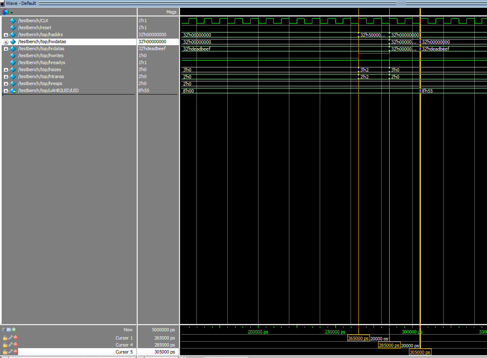
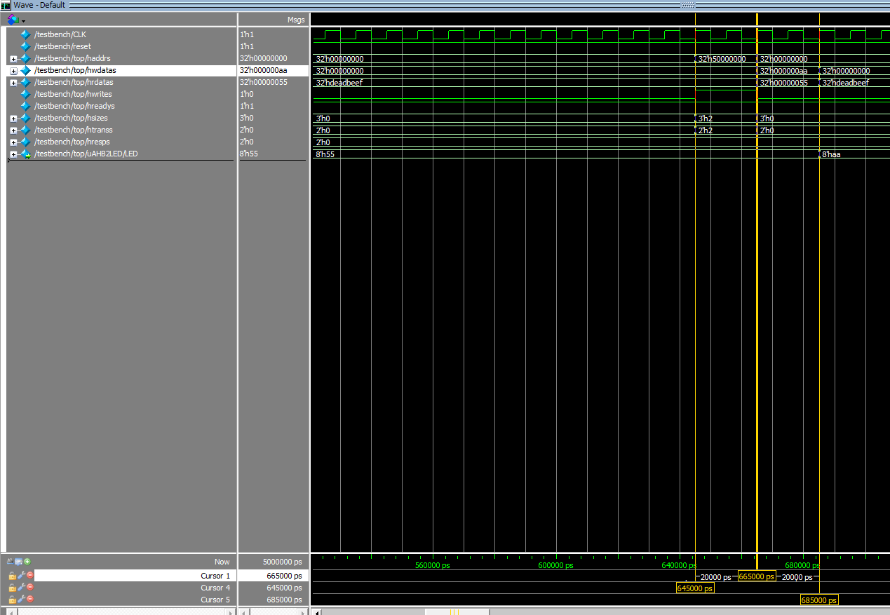
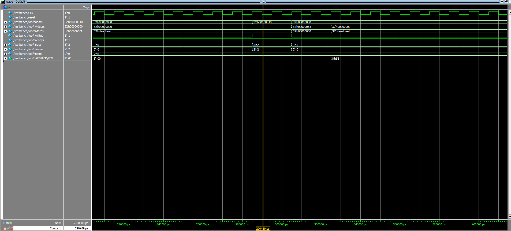
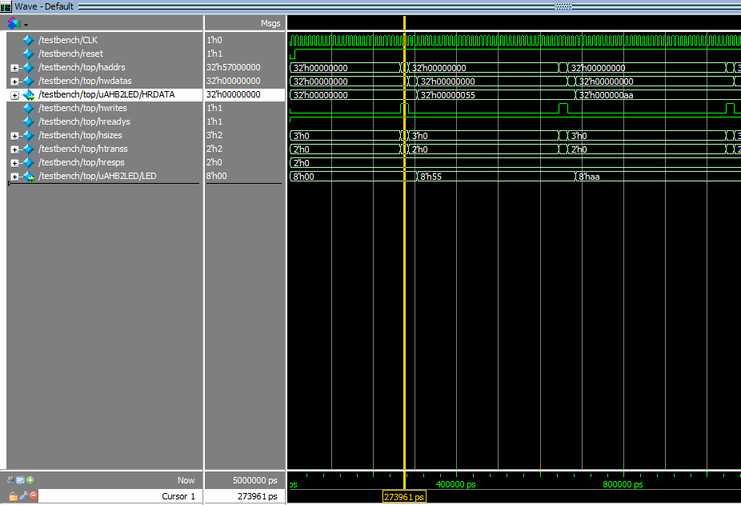
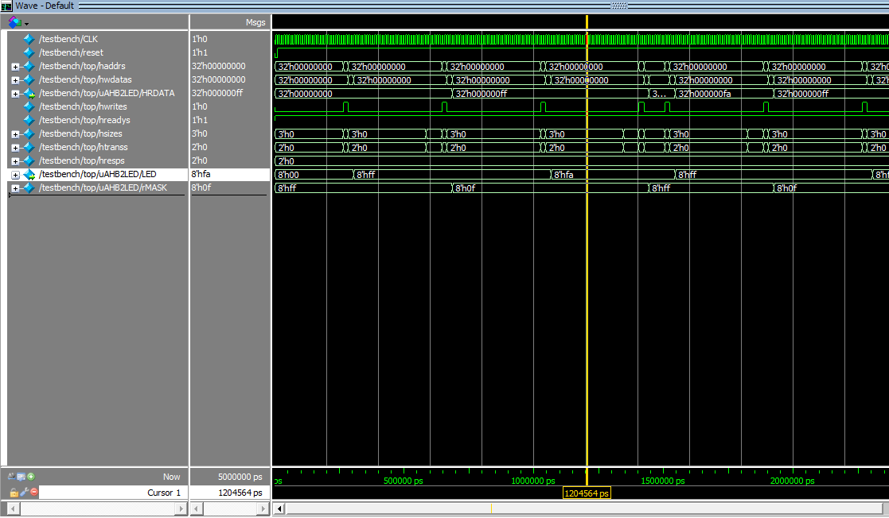

Jiyang Wang

`SUID`: 835234162

# CSE664 Lab4A Report

## Q1
>Run the simulation, take a look of the waveform and analyze the signal activities in the 
AHB transactions when the CPU writes to the LED register. Report the exact time of the 
address phase and data phase of the first 2 LED write transactions. Also report what 
signals are asserted (transmitted) during those two phases. 


<center> <small>Figure1</small> </center>

From Figure 1, we can know that, for the first transaction, the address phase is from `265000ps` to `285000ps`, the data phase is from `285000ps` to `305000ps`. LED changed from `0x00` to `0x55`.


<center> <small>Figure2</small> </center>

From Figure 2, we can know that , for the second transaction, the address phase is from `645000ps` to `665000ps`, the data phase is from `665000ps` to `685000ps`. LED changed from `0x55` to `0xaa`. 

In address phase, the address of peripheral devices were transmitted and in data phase the data to control LED been transmitted. 

## Q2
>Instead of writing to address 0x5000_0000, write to 0x5000_0010, and observe the LED 
signals. What do you see? 

Figure 1 shows when we write to `0x50000000`, Figure 3 shows when we write to `0x50000010`. Compare Figure 2 and 3 we can see the LED perform same. 


<center> <small>Figure3</small> </center>

## Q3
>. The LED register is currently mapped to memory address 0x5000_0000. Modify the 
source code and hardware design to map this register to 0x5700_0000. Simulate the 
whole system again and report the waveform of your simulation. Include the waveform 
in the report. The waveform should contain all aforementioned system bus signals and 
the LED signals as a proof that the address mapping has taken place and the LED register 
is written correctly.  

From `AHBDCD.v`

```verilog

assign HSEL_S8 = dec[8];   //MEMORY MAP --> 0x5700_0000 to 0x57FF_FFFF  16MB

```

So we need modify the `ARM_SOC.v`

```verilog

    // Address Decoder 
    AHBDCD uAHBDCD (
      .HADDR(haddrs),
     
      .HSEL_S0(hsel_mem),
      .HSEL_S1(),
      .HSEL_S2(),
      .HSEL_S3(),
      .HSEL_S4(),
      .HSEL_S5(),
      .HSEL_S6(),
      .HSEL_S7(),
      .HSEL_S8(hsel_led), // change the addr of LED
      .HSEL_S9(),
      .HSEL_NOMAP(),

      .MUX_SEL(mux_sel[3:0])
    );
```
Now the LED will react operations happened to `0x57000000`, Result shown in Figure 4.


<center> <small>Figure4</small> </center>

## Q4

>Based on (2), further modify the LED module and add an additional mask register that is 
read and writable by the CPU at memory address 0x5700_0004. A “0” in the mask 
register will prevent the corresponding bit in the LED register to be written (i.e. the 
corresponding bit in LED register will keep its previous value instead of being modified.) 
Modify your software program to test the mask function. You need provide a brief 
description of the steps that were taken in your test program, (e.g. step 1: write a 0Xff 
to LED register, step 2: write a 0x0F to the mask register, step 3: write a 0Xaa to LED 
register. Step 4: observe that the value in LED register is 0xaf.) Report the waveform for 
those steps.

**ARGUE**, Since The `0` in mask means keep it's previous value. Which means only update the `1` corresponding bits. So in questions, The step 4 should be `0xfa` instead of `0xaf` 


Further modify the `AHBLED.v`: 

```verilog

//Address Phase Sampling Registers
  reg rHSEL;
  reg [31:0] rHADDR;
  reg [1:0] rHTRANS;
  reg rHWRITE;
  reg [2:0] rHSIZE;

  reg [7:0] rRDATA;       // save data which read from LED
  reg [7:0] rLED;         
  reg [7:0] rMASK;        // Mask regiter
 
```

```verilog

//Data Phase data transfer
  always @(posedge HCLK or negedge HRESETn)
  begin
    if(!HRESETn) begin
      rLED <= 8'b0000_0000;
      rMASK<= 8'hff;
      rRDATA<= 8'h00;
    end 
    else if(rHSEL & rHWRITE & rHTRANS[1])begin
      if (rHADDR == 32'h5700_0004) begin
      	rMASK <= HWDATA[7:0];
      	rRDATA <= rMASK;
      end
    else begin
    	rRDATA <= rLED;
        rLED <= (HWDATA[7:0] & rMASK) | (rLED & ~rMASK); // update LED base on masks
    	end
    end
  end
 
//Transfer Response
  assign HREADYOUT = 1'b1; //Single cycle Write & Read. Zero Wait state operations

//Read Data  
  assign HRDATA = {24'h0000_00,rRDATA};

  assign LED = rLED;

```

The coresponding assembly code: `cmdsasm.s`: 1. Write LED `0xff`, 2. Set mask register as `0x0f`, 3. Write LED `0xaa`, 4. The result should be `0xfa`. 5. repeat.

```armasm

; Reset Handler

Reset_Handler   PROC
                GLOBAL  Reset_Handler
                ENTRY
                
AGAIN           LDR     R1, =0x57000000           ; Write to LED with value 0xff
                LDR     R0, =0xff
                STR     R0, [R1]

                LDR     R0, =0x5            	  ; Delay
Loop            SUBS    R0,R0,#1
                BNE     Loop

                LDR     R1, =0x57000004           ; Write to mask reg with 0x0f
                LDR     R0, =0x0f
                STR     R0, [R1]

                LDR     R0, =0x5	             ; Delay
Loop1           SUBS    R0,R0,#1
                BNE     Loop1
				
				LDR     R1, =0x57000000           ; Write to LED with value 0xaa
                LDR     R0, =0xaa
                STR     R0, [R1]

                LDR     R0, =0x5	             ; Delay
Loop2           SUBS    R0,R0,#1
                BNE     Loop2

				LDR     R1, =0x57000004           ; Write to mask reg with 0xff clean the mask
                LDR     R0, =0xff
                STR     R0, [R1]
				
                B AGAIN
                ENDP

```
Waveform Shown in Figure 5


<center> <small>Figure5</small> </center>

