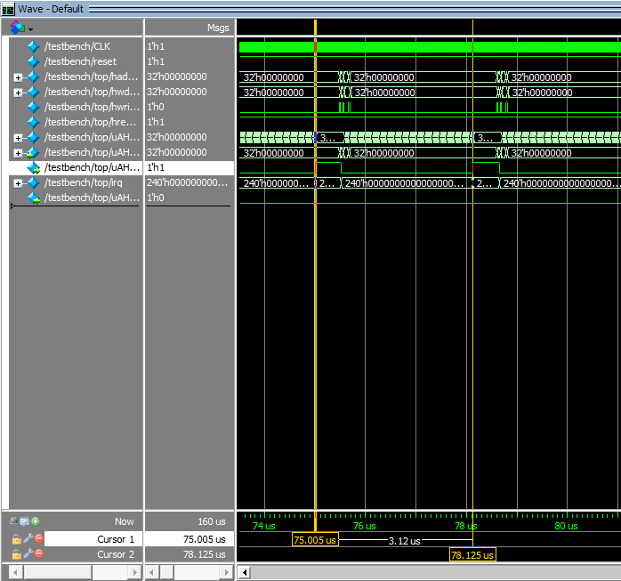
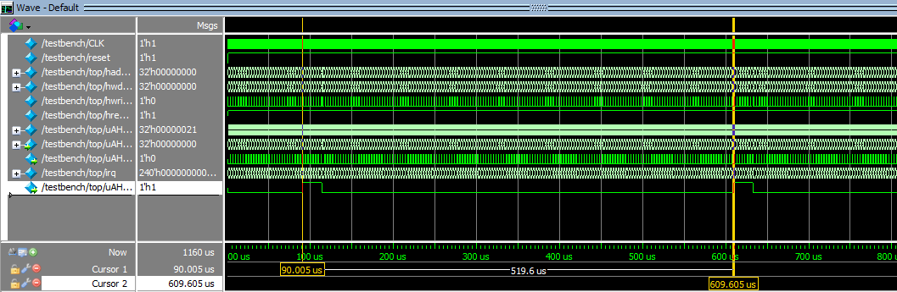
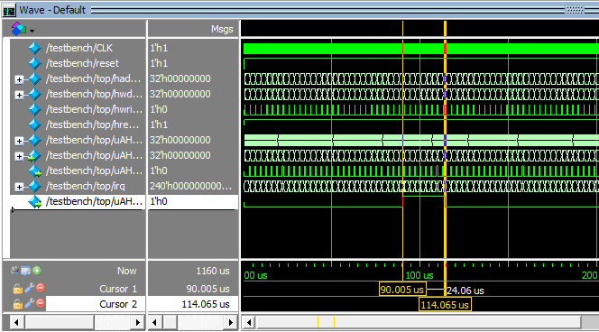
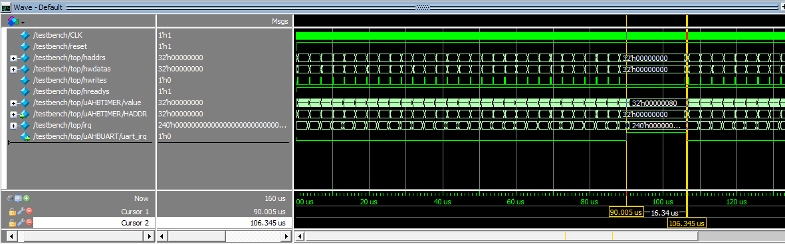
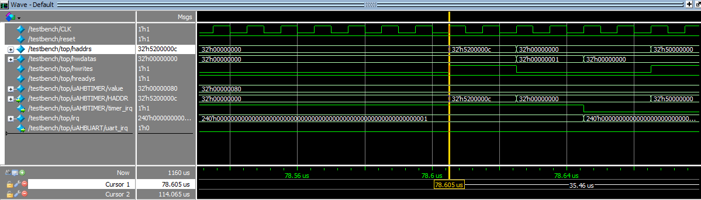
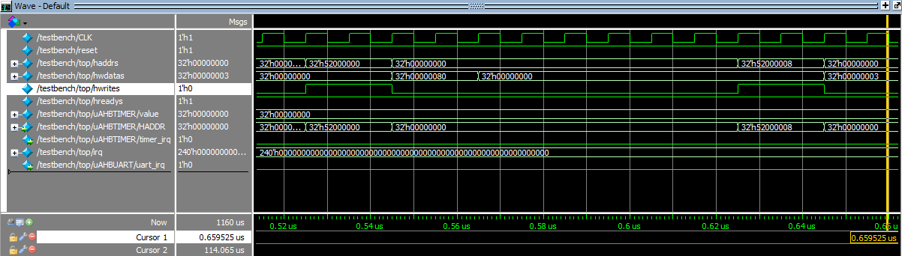
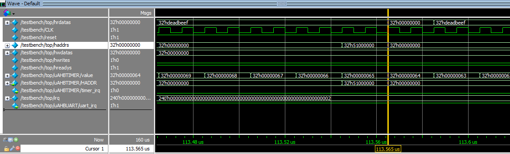
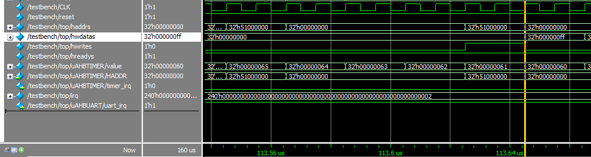
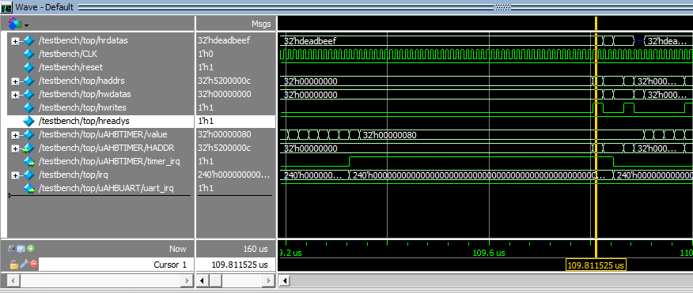

# CSE664 Lab4B Report

## STEP1
<!-- >Modify the file AHBTIMER.v to add logics to generate the timer interrupt signal, and add
the interrupt clear register. Writing to this register will clear the interrupt, otherwise the
interrupt will remain to be on.
 -->
First, define the address of clear interrupt register. Then add a new state called `st_intr` to manage the timer interrupt, and ready the timer to next load. When timer count to `0`, `timer_irq` enabled and trigger the interrupt. Interrupt cleared by writing `0x01` into `CLEADDR`(`0x5200000c`).

```verilog
// partial codes from AHBTIMER.v

  localparam [3:0] LDADDR = 4'h0;   //load register address
  localparam [3:0] VALADDR = 4'h4;  //value register address
  localparam [3:0] CTLADDR = 4'h8;  //control register address
  localparam [3:0] CLEADDR = 4'hc;	//clean interrupt flag
  
  localparam st_idle = 2'b00;
  localparam st_count = 2'b01;
  localparam st_intr = 2'b10;       //trigger interrupt

...

 // clear interrupt when processor access the CLEADDR register
  always @(posedge HCLK, negedge HRESETn)
    if(!HRESETn)
      timer_irq <= 1'b0;
    else if(last_HWRITE & last_HSEL & last_HTRANS[1])
      if(last_HADDR[3:0] == CLEADDR)begin
        if(HWDATA[1:0] == 8'h01)                     // judge command
          timer_irq <= 1'b0;
      end

...

  //Timer Operation and Next State logic
  always @*
  begin
    next_state = current_state;
    value_next = value;
    
    case(current_state)
      st_idle:
        if(enable && timerclk)
            begin
              value_next = load;
              next_state = st_count;
            end
      st_count:
        if (timer_irq)
          next_state = st_intr;
        else if(enable && timerclk)      //if disabled timer stops
            if(value == 32'h0000_0000)
              begin
             	timer_irq = 1'b1;       // When timer reach 0 shoot the interrupt
                if(mode == 0)           //If mode=0 timer is free-running counter
                  value_next = value-1;
                else if(mode == 1)      //If mode=1 timer is periodic counter;
                  value_next = load;
              end
            else
              value_next = value-1;
      st_intr:                          // The interrupt state to mannage the interrupt. 
        if (!timer_irq)
          next_state = st_idle;
    endcase
  end


```
## STEP2
<!-- >Modify the file AHBUART.v to add logics to generate the UART interrupt signal. -->

When `RX_FIFO` is not empty, trigger the other wise clear. 

```verilog

// partial codes from AHBTIMER.v

  //If Read and FIFO_RX is empty - wait.
  assign HREADYOUT = ~tx_full;
   
  //UART  write select
  assign uart_wr = last_HTRANS[1] & last_HWRITE & last_HSEL& (last_HADDR[7:0]==8'h00);
  //Only write last 8 bits of Data
  assign uart_wdata = HWDATA[7:0];

  //UART read select
  assign uart_rd = last_HTRANS[1] & ~last_HWRITE & last_HSEL & (last_HADDR[7:0]==8'h00);
  

  assign HRDATA = (last_HADDR[7:0]==8'h00) ? {24'h0000_00,uart_rdata}:{24'h0000_00,status};
  assign status = {6'b000000,tx_full,rx_empty};
  
  assign uart_irq = ~rx_empty;      // Interrupt depended on rx
  
  ```

## STEP3
<!-- >Modify ARMSOC_TOP.v to connect the interrupt requests from TIMER and UART to the
ARM core.
 -->
Connet to `IRQ`. Assign `timer_irq` to `[0]` and `uart_irq` to `[1]`.

```verilog

// partial codes from ARMSOC_TOP.v

    // Interrupt signals
    wire          uart_irq;
    wire          timer_irq;
    assign        irq[239:2] = 238'b0;

    assign irq[0] = timer_irq;
    assign irq[1] = uart_irq;

```

## STEP4
<!-- >Complete the assembly program to configure the timer at the beginning, and implement
the UART interrupt handler code. -->

Codes block below is the initialization of the timer and main loop. 

```armasm

Reset_Handler   PROC
                GLOBAL  Reset_Handler
                ENTRY
                
                LDR     R1, =0xE000E400         ; Interrupt Priority Register
                LDR     R0, =0x00004000         ; Priority: IRQ0(Timer): 0x00, IRQ1(UART): 0x40
                STR     R0, [R1]
                LDR     R1, =0xE000E100         ; Interrupt Set Enable Register
                LDR     R0, =0x00000003         ; Enable interrupts for UART and timer 
                STR     R0, [R1]

				MOVS	R0, #0x0		; 
				MSR		PRIMASK,  R0	; Clear PRIMASK register

        

                ;Configure the timer (To BE IMPLEMENTED)
				;(You need to read and understand the Verilog code of the timer in order to set it properly)
				;(Set timer load value register to 0x80. Each time when timer reaches 0, it will be reset to 0x80 and start count down)
				;(Set timer control register so that there is no prescaler, enable timer and set it to reload mode)
				;
                ;---------------------------------
				;-------Your Code-----------------
				;---------------------------------

                LDR     R5, =0x00000000         ; counting-up counter, start from '0' (ascii=0x30)  
				LDR 	R1, =0x52000000			; counter load value register
				MOVS	R0, #0x80
				STR     R0, [R1]
				LDR		R1, =0x52000008         ;Set control signal of timer
				MOVS	R0, #0x03               ; shut down prescaler, and enable timer and work in reload.
				STR     R0, [R1]
				
AGAIN       	                                ; MAIN LOOP
                B       AGAIN  
                
                ENDP

```

Codes block below is the implementation of `UART_HANDLER`.

```armasm

UART_Handler    PROC
                EXPORT  UART_Handler

                ;Complete the UART Interrup handler (To BE IMPLEMENTED)
				;(You need to read and understand the Verilog code of the timer in order to set it properly)
				;(Push the register that your are going to use into stack)
				;(Create a software loop of 256 iterations to waste some time)
				;(Read UART RX FIFO to get the RX data, write 0xFF to UART TX FIFO)
				;(Restore save register by poping them from stack)
                ;---------------------------------
				;-------Your Code-----------------
				;---------------------------------
				
				PUSH 	{R0, R1, R2, LR}
				LDR		R2, =0x00000100			;LOOP for 256 iterations
LOOP			SUBS	R2, R2, #1
				BNE 	LOOP
				
				LDR		R1, =0x51000000			;read data from RX FIFO
				LDR		R0, [R1]

				LDR		R1, =0x51000000			; write data to TX FIFO with 0xff
				MOVS	R0, #0xFF
				STR		R0, [R1]

                ENDP

```

## STEP5
<!-- > Simulate the SoC using modelsim. Use the provided run.do to touch initialize some
internal signals. You should see that timer interrupts generate approximately every
2.6us, and the UART interrupt generates at approximate 495 us. -->

The periods of both interrupt signals are close to reference values.


<center> <small> 78.125-75.005=3.12us</small>  </center>


<center> <small> 609.605-90.005=519.6us </small>  </center>

## STEP6
<!-- >Measure how long it takes for the CPU to process the UART interrupt -->


<center> <small> CPU needs 24.06 us to handle UART interrupt</small>  </center>

## STEP7
<!-- >Switch the interrupt priority of TIMER and UART, and check again how long does it take -->
<!-- to serve the UART interrupt. -->

From below figure, we can find that when we swap the priority setting of this two irqs. The uart won't be interrupted when it been triggered. As a result CPU required less time to handle uart interrupt. 

```verilog
                ; swap priorities between uart_irq and timer_irq
                LDR     R1, =0xE000E400         ; Interrupt Priority Register
                LDR     R0, =0x00000040         ; Priority: IRQ0(Timer): 0x40, IRQ1(UART): 0x00
                STR     R0, [R1]
                LDR     R1, =0xE000E100         ; Interrupt Set Enable Register
                LDR     R0, =0x00000003         ; Enable interrupts for UART and timer 
                STR     R0, [R1]

				MOVS	R0, #0x0		; 
				MSR		PRIMASK,  R0	; Clear PRIMASK register

```


<center> <small> CPU needs 16.343 us to handle UART interrupt</small>  </center>


## DISCUSSION

### Prove timer Interrupt

From below figure. We can know that when timer when counts to `0` timer handler will write `0x01` to `CLEADDR`(`0x5200000c`) to clean the timer interrupt. 



From below figure. We can know that, initially, `prescaler` of timer was disabled and timer worked in reload mode.



## Prove UART Interrupt

From below two figures, We can know that processor read/write UART FIFO through `0x51000000`. 




## Prove Priority (Timer Interrupt is Higher)

From below figure, we can know that timer interrupt can also handled by processor which means timer irq has higher priority. 

