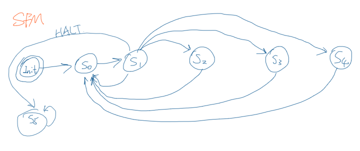

# CSE664_course_pj
course project

# refer from
> https://www.blankspace.cn/2019/01/20/verilog-8-bit-risc-cpu/

## syntax
|Syntax| Description| Synopsis| Opcode|
|---|---|---|---|
|ADD rs| ADD |Acc ← Acc + Reg[rs] |0001|
|SUB rs |SUB |Acc ← Acc – Reg[rs] |0010|
|NOR rs |NOR |Acc ← Acc | Reg[rs] |0011|
|MOVR rs |Move Register value to Acc| Acc ← Reg[rs] |0100|
|MOVA rd| Move Acc to Register| Reg[rd] ← Acc |0101|
|JZ rs |Jump if Zero to Reg Value| PC ← Reg[rs] if Zero |0110|
|JZ Imm |Jump if Zero to Immediate| PC ← Imm if Zero |0111|
|JC rs |Jump if Carry to Reg Value| PC ← Reg[rs] if Carry |1000|
|JC Imm |Jump if Carry to Immediate| PC ← Imm if Carry |1010|
|SHL |Shift Left Acc| Acc ← Acc << 1 |1011|
|SHR |Shift Right Acc| Acc ← Acc >> 1 |1100|
|LD Imm |Load Immediate to Acc |Acc ← Imm |1101|
|NOP |NOP |Do Nothing |0000|
|HALT| Halt |STOP Execution |1111 |

## op codes

[3:0][3:0] === [ops][reg/imm]

## FSM diagram

|State|Description|
|---|---|
|Sinit|initial state|
|S0|read 8bit opcode|
|S1|pc+1|
|S2|update pc|
|S3|update acc|
|S4|update reg|
|S5|HALT|

## changelog
@11/18/2019 10:40
1. `test_bench.v` : The address in follows pc.
2. `accum.v` : fixed the sel_acc mechanism. 
3. `alu.v` : changed the always rule update alu's registers only when `sel_alu` is none zero
4. `controller.v` removed.
5. `controller_v1.v` fixed some bugs.
6. `test_code.txt` added two //nop command to make `JC` command work properly.
7. `test_bench.v` Using pc to access address. blocked the self check part. 
8. `test_codes.v` Removed

**TODO**:
- fix `test_code.txt` following the guideness of waveform.
- activate the `test_bench.v`'s raise error feature.